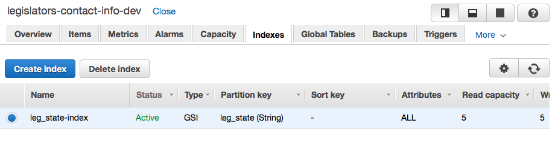
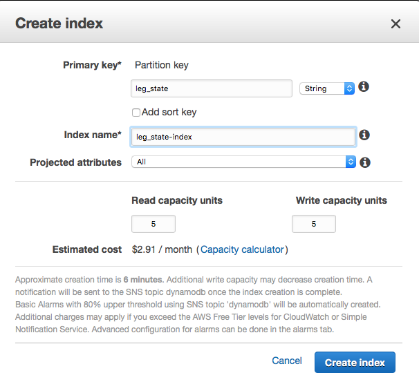

# Requirements

* [AWS Developers account](http://developer.amazon.com)
* [AWS Account](https://aws.amazon.com/)
* [Serverless Framework](https://serverless.com/)
* [Opearlo Alexa Skill Analytics](https://analytics.opearlo.com/)

## Installation

Create Opearlo Alexa Skill Analytics account and create a Voice Application. NOTE the App Name.

```
npm install serverless -g
git clone https://github.com/chaunceyt/legislators-skill.git
cd legislators-skill
npm install
npm install serverless -g
cd constants/ # cp constants.js.sample to constants.js and add alexa skill appId
cd ../
cp serverless.yml.example serverless.yml
vi serverless.yml # change the OPEARLO_API_KEY, OPEARLO_USER_ID, and OPEARLO_VOICE_APP_NAME values
serverless deploy # you will have to run again. This is deploy is to get the table ready for importing the data.
```

**Import data into DynamoDB**

```
cd importer
wget https://theunitedstates.io/congress-legislators/legislators-current.csv
npm install
npm run populate-db
```

*** Manually create a Global Secondary Index (GSI) ***
* Log into the AWS console and navigate to DynamoDB under "Databases"
* Click on the legislators-contact-info-dev table
* Click on the "Indexes" tab (see screenshots below for values)




*** Use shell script to create Global Secondary Index (GSI) ***
* Recommended:  ./create-gsi.sh (required aws cli configured)
* This is a work around not being able to create GSI via serverless.yml (WIP)

After the completion of the `serverless deploy -y` you should see the ARN for your function. 

## Create Alexa Skill
*  Log into http://developer.amazon.com 
* Navigate to Alexa Skills
* **Create a New Alexa Skill**
	* Skill Type: Custom
	* Language: English (US)
	* Name: U.S. Legislators Info
	* Invocation Name: my legislator
	* Click Next
* **Interaction Model**
	* Instance Schema (speechAssets/intentSchema.json)
	* Custom Slot Types 
	* Type: LIST_LEGISTATORS
	* Value: speechAssets/LIST_LEGISLATORS.txt (copy this content into input field)
	* Click Next
* **Configuration**
	* Select AWS Lambda ARN (Amazon Resource Name)
	* Enter the arn for lambda script
	* Accept defaults for everything else.
	* Click Next
* **Test**
	* Voice Simulator "_Hear how Alexa will speak a response entered in plain text or SSML_"	
	* Service Simulator - the EventSource for the Lambda function.
* **Publishing Information**
* **Privacy & Compliance**

Now got back and update constants/constants.js adding the Alexa Skill kit "Application Id"

i.e. amzn1.ask.skill.XXXXX-XXXXX-XXXXXX-XXXXX

run serverless deploy

